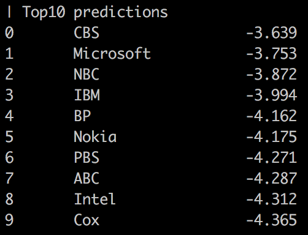
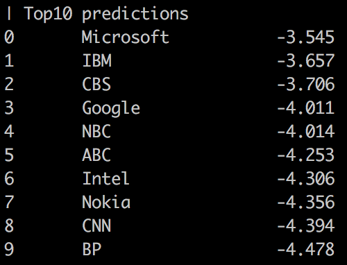

# LPAQA: Language model Prompt And Query Archive

This repository contains data and code for the paper [How Can We Know What Language Models Know?](https://arxiv.org/abs/1911.12543)

## Install
Our repository is based on [LAMA](https://github.com/facebookresearch/LAMA). Please download our fork
 from [here](https://github.com/jzbjyb/LAMA) and follow the instructions to set up the environment and download pre-trained language models.
```bash
# clone to the currect directory
git clone https://github.com/jzbjyb/LAMA .
# follow the instructions to install
./setup.sh
```

## Retrieve factual knowledge from LMs

For example, to query the owner of MSN (Microsoft is the answer), you can either use manually created prompts (*x is owned by y*):
```bash
python lama/eval_generation.py --lm bert --t "MSN is owned by [MASK]."
```


or use LPAQA that ensembles a diversity of prompts:
```bash
# mined prompts
python lama/eval_ensemble.py --lm bert --subject MSN --relation P127 --prompts prompt/mine
# paraphrased prompts
python lama/eval_ensemble.py --lm bert --subject MSN --relation P127 --prompts prompt/paraphrase
```

